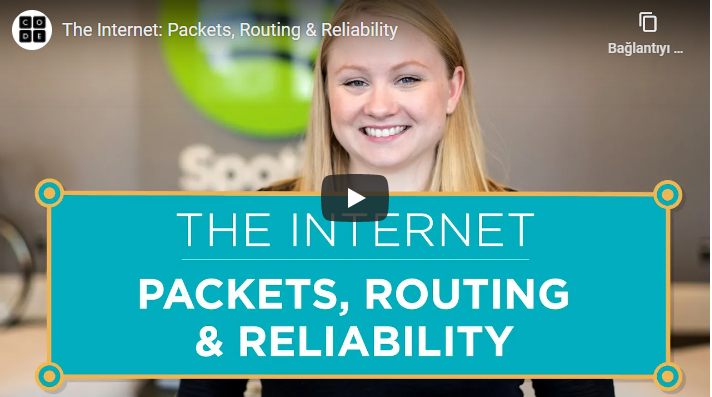

# PAKETLER, YÖNLENDİRME ve GÜVENİLİRLİK

Bilginin bir cihazdan diğerine gitmesi için illa ki dümdüz bir yola ihtiyacı yoktur. Bu yol karmaşık olabilir. Trafik durumuna göre veri farklı yollardan hedefe ulaşabilir. Bu trafiği yönlendiriciler(routers) yönetir.

Bilgi bitlere dönüştükten sonra paketler içerisinde hedefe gönderilir. Her paket içerisinde hedef ve kaynak IP adresler bulunur. Böylelikle nereden geldiği ve nereye gideceği bilgisi karışmaz. Paketler farklı yollardan veya farklı zamanlarda hedefe ulaşabilir. Tüm paketler hedefe ulaştığında birleştirilir ve bilgi bütünleşir.

Peki paketler hedefe ulaşamazsa ne olur ? Bu durumun çözümü olarak yeni bir protokol karşımıza çıkıyor: TCP(Transmission Control Protocol). TCP tüm paketlerin geldiğini onaylayana kadar paketleri tekrar tekrar talep ediyor. Tüm paketler geldiğinde ise işlem tamamlanıyor, TCP işlemi onaylıyor.

* Farklı yol seçenekleri(Yönlendiriciler yardım eder)-> Arızaya dayanıklılık, Güvenilirlik, Yedeklilik

* TCP+Yönlendiriciler -> Ölçeklendirilebilirlik

Aşağıdaki videoda paket ile iletişimin, yönlendiricilerin ve TCP protokolünün nasıl birlikte çalıştığını görebilirsiniz. Ayrıca videoyu izlerken altyazılardan "Türkçe" seçmeyi unutmayın.

## Kaynaklar:
- https://roadmap.sh/guides/what-is-internet
- https://www.youtube.com/watch?v=kHxcf2wK_ck&feature=youtu.be
- https://code.org/

