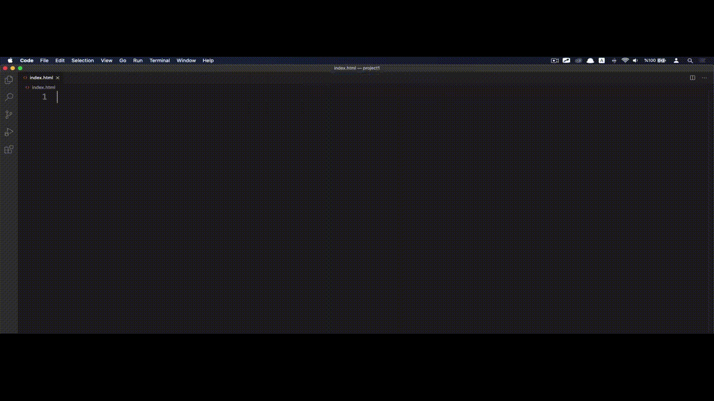
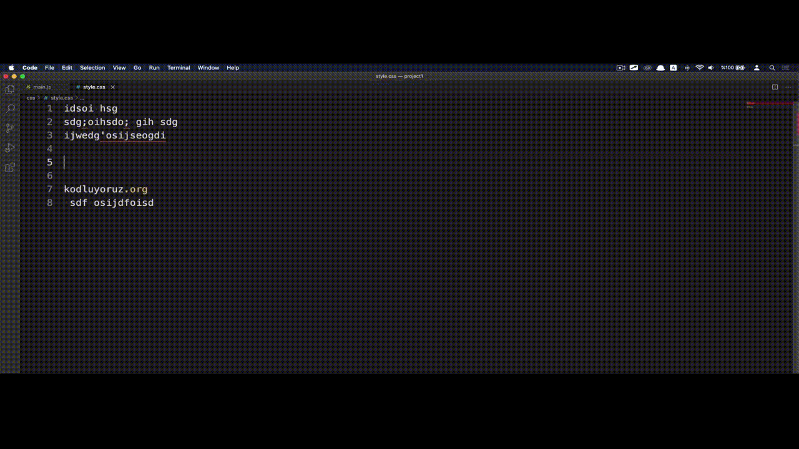
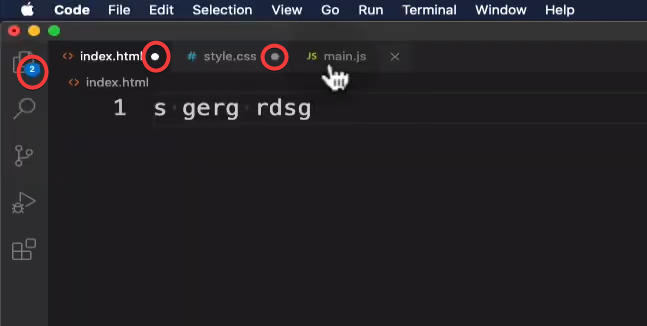
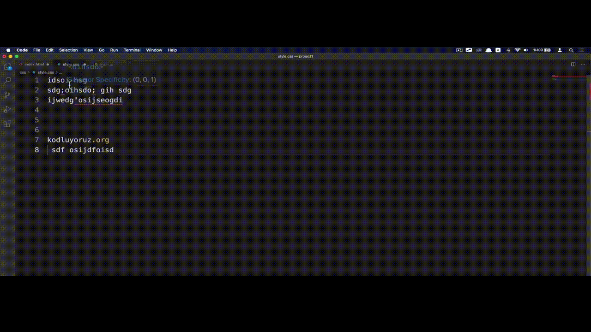
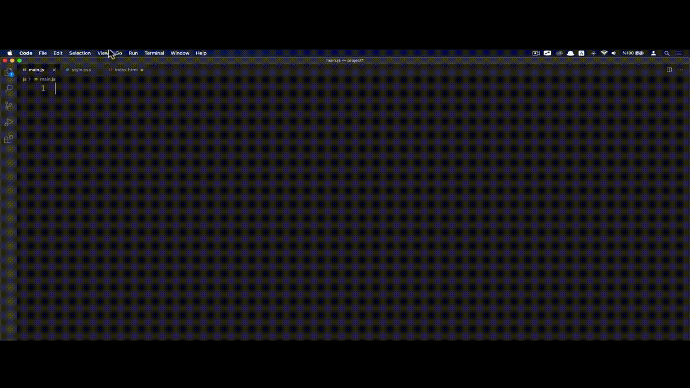

# VS CODE | Panellerin Yönetimi ve Dosyalar İle Çalışmak	

Bu yazımızda Visual Studio Code içerisindeki panellerin yönetiminden ve yine kod editörü içerisinde yapabileceğimiz işlemlerden adım adım bahsedeceğiz. Ek olarak sizden bu adımları inceleyip, anladıktan sonra kendi Visual Studio Code editörünüzde adımları denemenizi istiyoruz. 

## Adım 1: Panelleri Açıp Kapatmak

Projemizdeki dosya isimlerine hakim olmaya başladığımızda menü çubuğunda yer alan panellere çok sık ihtiyaç duymayacağız. Panelleri ihtiyacımız olmadığında kapatmak ve sadece gerekli olduğunda açmak için iki yolumuz var.

### a) Panel Üzerine Tıklamak

Bir paneli açmak ya da kapatmak için izleyeceğimiz ilk yol, menü çubuğu üzerinden panelin ikonuna tıklamaktır. Bu yolu klavye kısayollarını öğrenene kadar izleyebiliriz.

### b) CTRL + B Kısayolunu Kullanmak

İki elimizi de kod yazarak kullandığımız sırada paneli kapatmak için mouse kullanmak bir zaman kaybıdır. İşte tam da bu sırada klavye kısayollarının önemini anlamış oluruz. Çalışmanızda bir paneli kapatmak **CTRL** + **B** kısayolunu kullanabilirsiniz.

## Adım 2: Dosya Açmak

Projemizde bulunduğumuz dosyadan farklı bir dosyayı açmak istediğimizde sağdaki menü çubuğunu ve oradaki panelleri kullanabiliriz. Ancak yukarıda da bahsettiğimiz gibi bu bir zaman kaybıdır. Zamanı iyi değerlendirmek için klavye kısayollarını öğrenmek ve onları kullanmak bizler için önemli bir çözümdür.

Birinci adımda da olduğu gibi "Adım 2"de de kullanabileceğimiz bir klavye kısayolu mevcuttur. Bulunduğunuz dosyadan farklı bir dosyayı açmak istediğinizde **CTRL** + **P** kısayolunu kullanabilirsiniz. Bu kısayolu kullandığınızda karşınıza çıkacak menüde açmak istediğiniz dosyanın ismini yazarak bulduktan sonra üzerine gelip **Enter** tuşuna basabilirsiniz.

Bu örneğimizde *index.html* açıkken **CTRL** + **P** kombinasyonuyla açtığımız menüden *style.css* dosyasını başarılı bir şekilde açtık.

Ek olarak menüdeki pencere ikonuna basarak açmak istediğiniz dosyayı yan pencerede açabilirsiniz. Bu örneğimizde *style.css* dosyayı açıkken *index.html* dosyasının yanındaki pencere ikonuna basarak onu yan pencerede açtık.

## Adım 3: Açık Olan Dosyaları Kapatmak

Projenizde açık olan dosyaları **CTRL** + **W** kombinasyonunu kullanarak kapatabilirsiniz. Sonrasında istediğiniz dosyayı, ikinci adımdaki gibi **CTRL** + **P** kombinasyonunu kullanarak tekrar açabilirsiniz.

## Adım 4: Dosyalar Arası Geçiş Yapmak

Açık olan dosyalar arasında geçiş yapmak için ilk öncelikle **CTRL** + **Tab** kombinasyonunu kullanmalı ve **CTRL** tuşundan elinizi çekmeden yukarıda açılacak menüde **Tab** tuşuna basarak geçiş yapmak istediğiniz dosyayı seçmelisiniz.

Bu örneğimizde *style.css* dosyası açıkken **CTRL** + **Tab** kısayolunu kullandık ve **CTRL** tuşundan elimizi çekmeden yukarıda açılan menüde **Tab** tuşuna basarak *index.html* dosyasını seçtik. Böylece başarılı bir şekilde *style.css* dosyasından *index.html* dosyasına geçiş yapmış olduk.

## Adım 5: Değişiklikleri Kaydetmek

Yaptığınız değişiklikleri kaybetmemek ve onların çıktılarını kolayca görebilmek için yapmanız gereken dosyayı kaydetmektir. Visual Studio Code'un ilk ayarlarında "Otomatik Kaydetme" özelliği olmadığından dosyalarda yaptığınız değişikleri sizin kaydetmeniz gerekmektedir. Ek olarak yine Visual Studio Code içerisinde dosyalarda yaptığınız değişiklerin henüz kaydedilmediğini hatırlatmak amacıyla bazı ikonlar yer almaktadır. 

Bu örnekte görüldüğü gibi dosyaların ve menü çubuğundaki panelin köşesinde yer alan ikonlar, dosyaların kaydedilmediğini gösterir. Dosyalardaki değişiklikleri kaydetmek için iki yol vardır.

### a) File Menüsünü Kullanmak

Dosyalardaki değişiklikleri kaydetmenin ilk yolu *File* menüsünden **Save** ya da **Save All** seçeneklerinden birini seçmektir.

### b) CTRL + S ve CTRL + ALT + S Kısayollarını Kullanmak

Dosyalarınızı kaydetmek için **CTRL** + **S** klavye kısayolunu kullanabilirsiniz. Projenizde yer alan tüm dosyalardaki değişiklikleri kaydetmek için **CTRL** + **ALT** + **S** kombinasyonunu kullanabilirsiniz. Klavye kısayollarını kullanmak daha pratiktir ve size zaman kazandıracaktır.

Adımlarımız buraya kadardı ancak ek olarak sizlere **View** menüsünde yapabileceklerimizden de bahsetmek istiyoruz.

## View Menüsü

View menüsünde yapabileceğimiz birçok işlem bulunuyor. Gelin bu işlemlere bakalım.

### a) Editor Layout

Bu kısımda kod editörünüzün pencere sayısını ve boyutlarını ayarlayabilirsiniz.

### b) Show Minimap

Visual Studio Code editörünün sağ kısmında dosyanızın küçük bir haritası yer alır. Bu haritayı, *Show Minimap* kısmından kapatıp açabilirsiniz.

### c) Show Breadcrumbs

Bu seçenek ile dosya isminizin köşesinde yer alan ve dosyanın nerede olduğunu gösteren ikonları kapatıp açabilirsiniz.