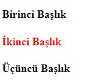

# Class ve Id Kullanımı

Web sayfamızı oluştururken HTML elementlerimize bazı stil özellikleri eklemek isteriz. Bazı yazıların renkli, bazı resimlerin küçük veya bazı butonların farklı şekilde olması gerekebilir ve biz de bunun için CSS kullanırız. 

Aşağıda html elementlerine nasıl stil özellikleri eklediğimize bakalım.

```html
<p>Bugün kodluyoruz</p>
<p>Yarın da kodluyoruz<p>
```

```css
p {
	color: red;
}
```

**Sonuç**:


Yukarıda görüldüğü üzere iki farklı `<p></p>` elementimize kırmızı renk özelliği eklemiş olduk. Fakat sadece belirli `<p></p>` elementine istediğimiz herhangi bir özelliği eklemek istersek ne yapacağız? Bu durumda `class` veya `id` seçicilerini kullanmamız gerekiyor.

#### `class` Kullanımı

Class seçicisi, HTML üzerinde aynı class’a sahip elemana ulaşmamızı sağlar.

Class seçicisi CSS’de `.` ile belirtilir.

```css
.class{
     özellikler
}
```

```html
<h4>Birinci Başlık</h4>
<h4>İkinci Başlık</h4>
<h4>Üçüncü başlık</h4>
```

Yukarıda 3 adet `<h4></h4>` elementimiz bulunuyor. Bunlardan sadece ikincisine kırmızı renk özelliği eklemek istersek class seçicisini kulanabiliriz.

```html
<h4>Birinci Başlık</h4>
<h4 class="text-red">İkinci Başlık</h4>
<h4>Üçüncü Başlık</h4>

```

Daha sonra bunu istediğimiz özelliği ekleyelim.

```css
.text-red{
   color:red;
}

```

**Sonuç:**


Bir class’ı birden fazla HTML elementi için kullanabiliriz.

```html
<h4>Birinci Başlık</h4>
<h4 class="h-green">İkinci Başlık</h4>
<h4 class="h-green">Üçüncü Başlık</h4>

```

```css
.h-green {
   color:green;
}
```

**Sonuç:**


Eğer bir HTML elementinin birden fazla class özelliğine sahip olmasını istiyorsak aynı anda iki farklı class’ı kullanabiliriz. Bunun için sadece iki class arasına boşluk bırakmak yeterli olacaktır.

```html
<h4>Birinci Başlık</h4>
<h4 class="h-blue">İkinci Başlık</h4>
<h4 class="h-blue thick">Üçüncü Başlık</h4>

```

```css
.h-blue{
    color:blue;
}
.thick{
       font-style: italic;
}

```

**Sonuç:**


Bir HTML elementi kendini kapsayan elementin (parent elementi) stil özelliklerine sahip olur.

```html
<div class="intro">
  <p>Birinci Paragraf</p>
  <p>İkinci Paragraf</p>
</div>
```

```css
.intro{
    color:pink;
 }
```

**Sonuç:**


Yukarıda `<div></div>` elementine CSS özelliği ekledik fakat altındaki elementler (child elementleri) de bu özelliğe sahip oldu.

#### `id` kullanımı

Id seçicisi, HTML üzerinde aynı id’ye sahip elemana ulaşmamızı sağlar.

Id seçicisi CSS’de `#` ile belirtilir.

Id seçicisinin kullanım amacı olarak class seçicisinden bir farkı yok diyebiliriz. İkiside belirli HTML elementlerine CSS özellikleri eklemeye yöneliktir. Fakat Id seçicisinin class seçicisinden bazı farkları vardır.

```css
#id {
     özellikler
}

```

Bir id’yi sadece bir HTML elementi üzerinde kullanabiliriz.

```html
<h4 id="main-title">Birinci Başlık</h4>
<h4>İkinci Başlık</h4>
```

```css
#main-title{
	color:red;
}

```

**Sonuç:**


Aşağıdaki **yanlış** bir kullanımdır!

```html
<p id="title">Birinci paragraf</p>
<p id="title">İkinci paragraf</p>
```

Bir html elementinin sadece bir tane id’si olabilir. 

Aşağıdakiler **yanlış** kullanımlardır.

```html
<p id="title" id="text-green">Birinci paragraf</p>
<p id="title text-blue">İkinci paragraf</p>
```

Böyle kullanımlar geçerli **değildir.**

## Kaynaklar

- [W3Schools](https://www.w3schools.com)