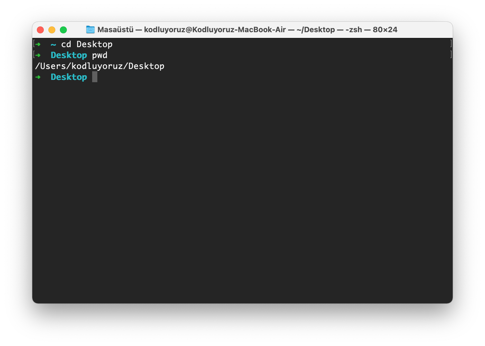
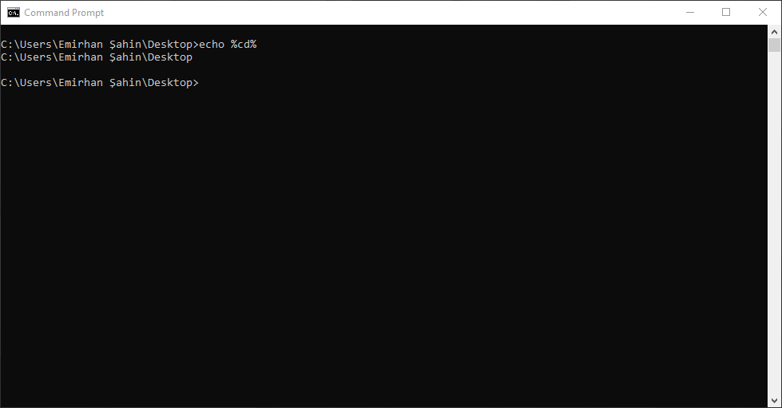
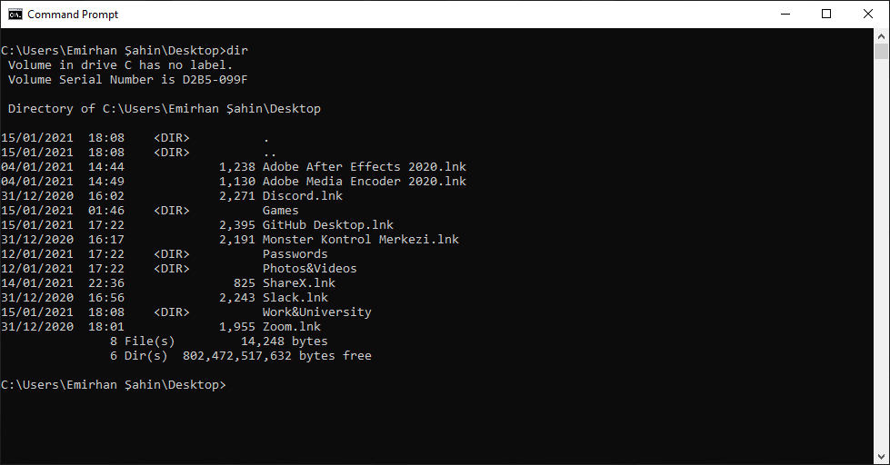
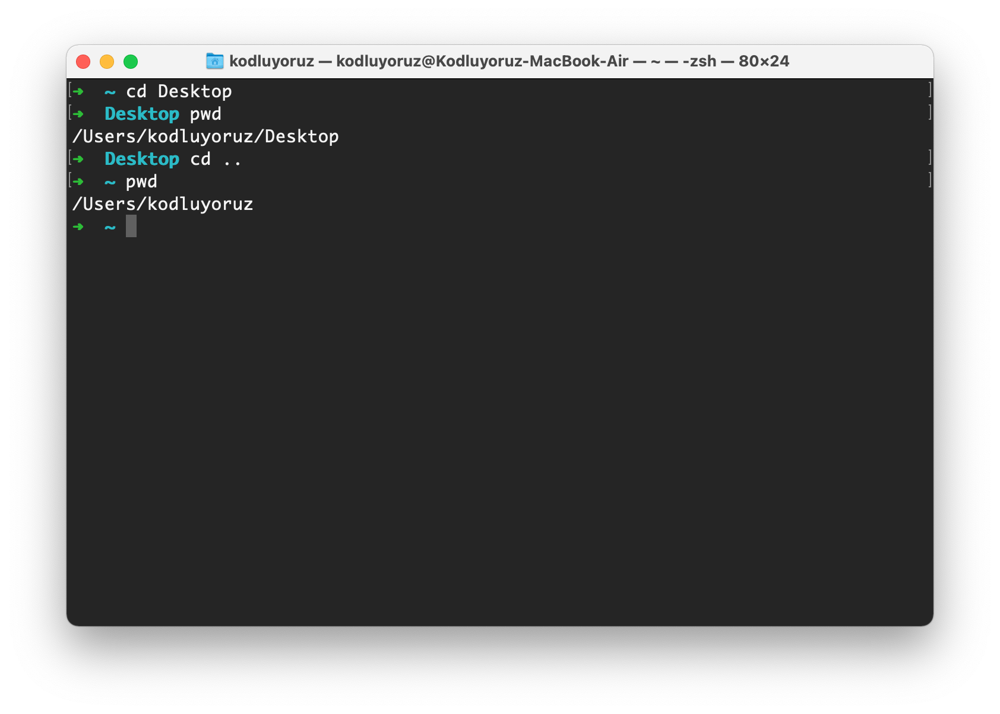
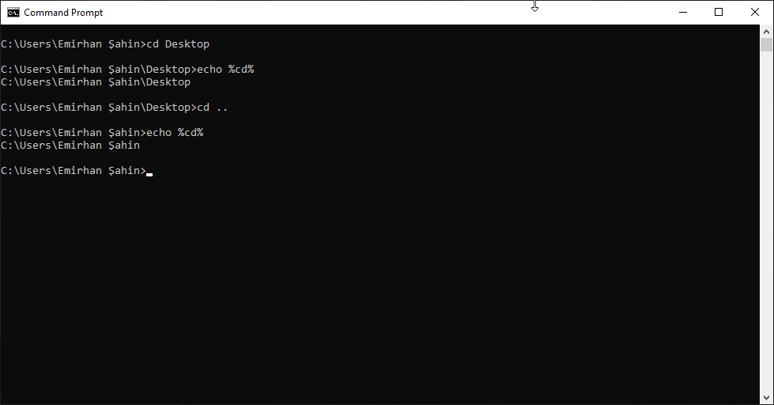
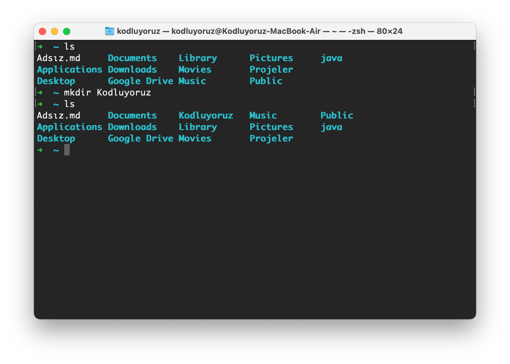
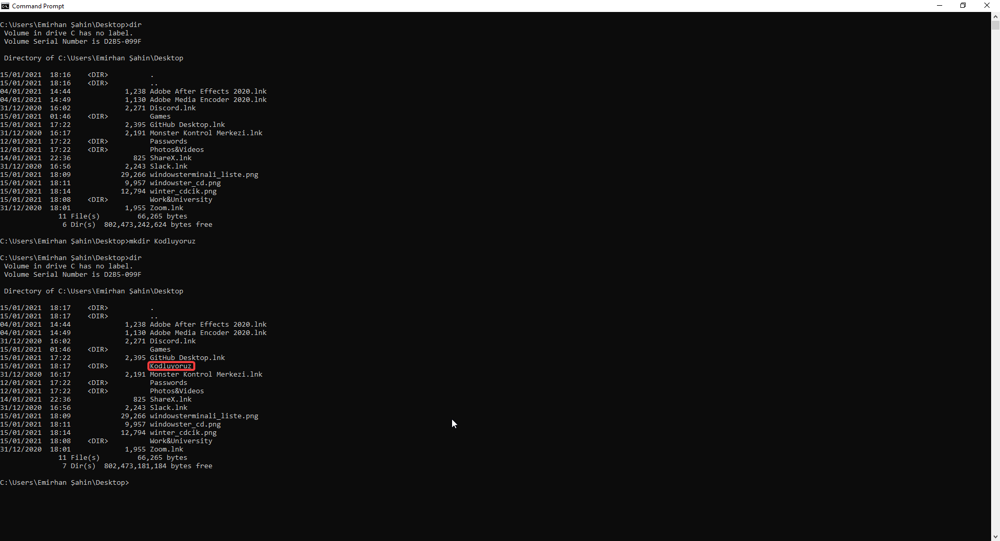

# TERMİNAL 

## Terminal Nedir?

Terminal nasıl kullanılır anlamak için önce terminalin ne olduğunu anlamak gerekir. Bunun için de ilk olarak komut satırından bahsetmek istiyoruz. Komut satırı, bilgisayarınız için bir yazı arabirimidir. Terminal ise yazdığınız komutları bilgisayar işletim sistemine göndermek için geliştirilmiş bir programdır. 

Yazılım alanında kendinizi daha da geliştirmek istediğinizde yollarınız terminalle kesişebilir ve terminale bazı komutları girmeniz gerekebilir. Peki terminali nasıl kullanacaksınız? Gelin şimdi bundan bahsedelim.

## Terminal Nasıl Kullanılır?

Bu kısımda terminale yazdığınız komut satırlarıyla, tıpkı **Finder** uygulaması ile **Mac OS**‘da veya **Windows Explorer** ile **Windows**‘da yaptığınız gibi, bilgisayarınızdaki dosya veya klasörlere nasıl ulaşabileceğinize ve nasıl yeni klasörler oluşturabileceğinizi anlatacağız. 

### Adım 1: Terminali Açmak

İlerlemeden önce, sizlerden kullandığınız işletim sisteminin terminali açmanızı ve sonrasında adımlarda yer verdiğimiz komut satırlarını denemenizi rica ediyoruz. Bu şekilde açıklamasını okuduğunuz komut satırlarını daha kolay öğrenebilir ve hatırlayabilirsiniz.

Ek olarak terminalde kullanacağınız komut satırları Linux ve Mac OS işletim sistemlerinde benzerlik gösterirken; Windows işletim sisteminde küçük farklılıklar gösterebilir. Gelin şimdi "Adım 1"e dönelim ve terminali nasıl açacağımızdan bahsedelim.

**Terminal** uygulamasını başlatmak için:

#### Windows
**Windows** tabanlı sistemlerde ilk önce **Win** + **R** tuşlarına birlikte basın ardından, açılan **Çalıştır** penceresine *cmd* yazıp **Enter** tuşuna basabilirsiniz.

#### MacOS
**Mac OS** bilgisayarlarda ilk önce **⌘** **+** **Space** tuşlarına birlikte basın ardından **Spotlight Search** açıldıktan sonra **terminal** yazıp **Enter** tuşuna basabilirsiniz.

#### Linux
**Linux** tabanlı sistemlerde **Ctrl** + **Alt** + **T** tuşlarına birlikte basabilirsiniz.

### Adım 2: Bulunduğunuz Klasörü Görmek

Terminali ilk açtığınızda dosya sistemi üzerinde sizi varsayılan olarak bir noktada başlatır. Bu kullandığınız işletim sistemine göre farklılık gösterebilir. Genellikle bütün sistemlerde başlangıç noktası **sistem kullanıcı klasörünüzün** içidir. 

Bu konum sistemler için genellikle bu konumlardadır;
* Windows(10) için `C:\Users\kullanici_adi`
* MacOS için `/Users/kullanici_adi`
* Linux için `/home/kullanici_adi`

Bulunduğunuz klasörü terminal ekranına yazdırmak için:

* *Mac Os* ve *Linux* tabanlı sistemlerde terminale `pwd` komutunu yazabilirsiniz.

* Windows tabanlı sistemlerde terminale `echo %cd%` komutunu yazabilirsiniz.

  

#### Bilgi Köşesi!

* `pwd` : Bu komut satırı *Mac Os* ve *Linux* tabanlı sistemlerde terminale yazıldığında halihazırda bulunulan klasörü ekrana yazdırır.
* `echo %cd%` : Bu komut satırı *Windows* tabanlı sistemlerde terminale yazıldığında halihazırda bulunulan klasörü ekrana yazdırır.
* *İleride işletim sistemleri arasında bir geçiş yapmak istediğinizde dosya yollarını ayırmak için windows'un `\` ters slash kullandığını ve Linux/MacOS ikilisinin ise `/` düz slash kullandığını unutmayın!*

#### Video Zamanı!

### Adım 3:  İçerikleri Sıralamak

Bulunduğunuz klasördeki içerikleri ekrana yazdırmak için, bir başka deyişle bulunduğunuz klasörün içerisinde bulunan dosya ve klasörleri görebilmeniz için:

* **Mac Os** ve **Linux** tabanlı sistemlerde terminale `ls` komut yazabilirsiniz.

  

* **Windows** tabanlı işletim sistemlerde terminale `dir` komut yazabilirsiniz.

#### Bilgi Köşesi!
Bazı komutlar Windows ve MacOS/Linux arasında farklılıklar gösterebilir. Bunun temel sebebi Linux ve MacOS'un `Unix` tabanlı olması ve Windows'un kendine özgü `nt` tabanını kullanmasıdır.

* `ls` : Bu komut **Mac Os** *ve* **Linux** tabanlı sistemlerde terminale yazıldığında klasördeki içerikler listelenir.
* `dir` : Bu komut **Windows** tabanlı sistemlerde terminale yazıldığında klasördeki içerikler listelenir.

#### Video Zamanı!

### Adım 4: Klasörler Arası Geçiş Yapmak

#### a) Klasöre Girme

Bulunduğunuz klasördeki içerikleri listeledikten sonra, karşınıza çıkan herhangi bir klasöre girmek için:

* *Windows*, *Mac Os* ve *Linux* tabanlı sistemlerde terminale `cd` komutunu verebilirsiniz.
* Bu komut `cd` yanında bir parametre daha alır. Bu parametre girmek istediğiniz klasörün adıdır.

**Örnek:**
`cd Desktop` komutu size bir alt klasördeki desktop'un yani masaüstünün içerisine girmenize olanak verir. İleride farklı dillerde veya frameworklerde bir kurulum yapacağınız zaman `cd`komutu ile ilgili proje klasörüne gitmeniz gerektiğini unutmayın!

**Örnek:**

 `cd Desktop` komutuyla **Desktop** klasörüne gittik.  Dosya yolunu rahat görebilmeniz için `pwd` komutunu kullandık. Gördüğünüz gibi yeni dosya yolumuz `/Users/kodluyoruz/Desktop` oldu. 

##### b) Klasörden Çıkmak

Bulunduğunuz klasörden bir üst klasöre çıkmak için:

* *Windows*, *Mac Os* ve *Linux* tabanlı sistemlerde terminale `cd ..` komutunu yazabilirsiniz.

**Örnek:**

Bir önceki komutla birleştirirsek `cd Desktop` komutuyla **Desktop** klasörüne gittik.  Dosya yolunu rahat görebilmeniz için `pwd` komutunu kullandık. Gördüğünüz gibi yeni dosya yolumuz `/Users/kodluyoruz/Desktop` oldu. Ardından. `cd ..`komutuyla tekrardan bir üst klasöre geri döndük.

##### Bilgi Köşesi!

`cd <klasorismi>` : Bu komut satırı *Windows*, *Mac Os* ve *Linux* tabanlı sistemlerde terminale yazıldığında ismi yazılan dizine girilir. 

`cd ..` : Bu komut satırı *Windows*, *Mac Os* ve *Linux* tabanlı sistemlerde terminale yazıldığında bir üst dizine geri dönülür.

#### Video Zamanı!

### Adım 5: Yeni Klasör Oluşturmak

Bulunduğunuz klasörün içinde yeni bir klasör oluşturmak için:

* *Windows*, *Mac Os* ve *Linux* tabanlı sistemlerde terminale `mkdir` komutunu yazabilirsiniz.

* Bu komut satırı *mkdir* yanında bir parametre daha alır. Bu parametre oluşturmak istediğiniz klasörün adıdır.

**Örnek:**

Oluşturduğumuz klasörü rahat görebilmeniz için önce `ls` komutuyla klasörümün içerisindekileri listeledim. Ardından `mkdir Kodluyoruz` komutuyla klasör içerisinde **Kodluyoruz** adında bir klasör oluşturdum. Ardından verdiğim `ls` komutunun çıktısında **Kodluyoruz** klasörünün oluştuğunu görebilirsiniz.

#### Bilgi Köşesi!

`mkdir <klasorismi>` : Bu komut satırı *Windows*, *Mac Os* ve *Linux* tabanlı sistemlerde terminale yazıldığında belirtilen klasör isminde yeni bir klasör oluşturur. 

#### Video Zamanı!

