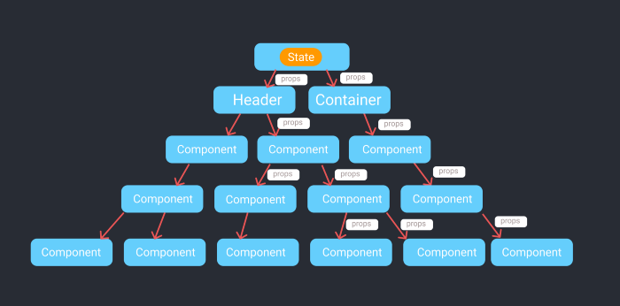
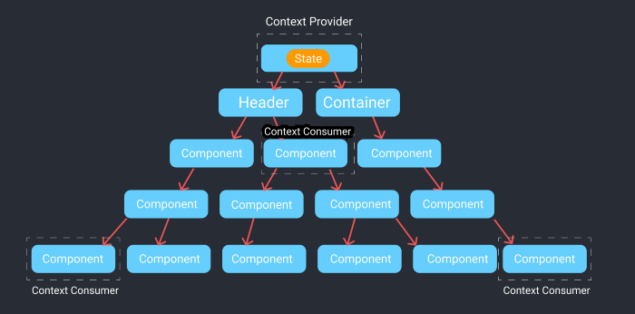

# Context API

## Sorun

React Context API ile **prop drilling** denen sorunun önüne geçmeyi amaçlanmaktadır.

## Prop Drilling Nedir?

Prop drilling, bir `state`'in component ağacımızın daha yukarısında bulunan bir **parent** component'ten, component ağacımızın altlarında bulunan bir **child** component’e `props` yoluyla aktarılarak `state`’in ulaştırılmasına denir. Buradaki sorun, `state` yukarıdan aşağıya doğru aktarılırken, arada köprü olarak kullandığımız component'lerin sadece bu değeri ulaştırmak için gereksiz yere kullanılıyor olmasıdır. Aşağıda bulunan component ağacımızı bir inceleyelim.

Bir state’imiz olduğunu düşünelim (array, nesne veya string türünde bir değer olabilir) ve bunu en alttaki component’te kullanmamız gerekiyorsa, yapacağımız işlem bu state değer veya değerlerini o component’te tanımlamak olacaktır.


Bir süre sonra bu değerin sadece o component’te değil de sibling dediğimiz yanında bulunan başka bir component’te daha kullanmanız gerektiğinde, bu state’i diğer component’te aktarabilmemiz için, state’i daha üstte bulunan bir component’e taşıyarak props yoluyla component'lere aktarmamız gerekecektir.


Aradan bir süre daha geçti ve bu state’in yine aynı şekilde başka component’lerde de kullanılma ihtiyacı olduğunu varsayalım. Yine aynı şekilde state’i diğer component'lere aktarabilmek için, state’i component ağacında daha yukarıda bulunan bir component’e taşımanız gerekecektir.


Biraz daha zaman geçtikten sonra bu aktardığımız state’i farklı bir dal’da bulunan (örneğin Container dalının en altında bulunan) bir component’e aktarmak istediğimiz zaman, o state’i daha yukarıya taşımamız gerekecektir.



Görselde de görebileceğiniz gibi component ağacımızın yukarısında bulunan bir component’ten, altlarda bulunan bir child component'e bir değer aktarmak istediğimiz zaman arada birkaç component’e de sadece bu değeri aktarabilmek için props yoluyla göndermek zorunda kalıyoruz. İşte bu duruma prop drilling denmektedir. **Prop drilling** ile ilgili küçük bir örnek yapalım.

```javascript
const App = () => {
  const [title, setTitle] = React.useState("Hello World")
  return (
    <HeaderContainer title={title} />
  )
}

const HeaderContainer = (props) => {
  const { title } = props;
  return (
    <HeaderBackground>
      <HeaderTitle title={title} />
    </HeaderBackground>
  )
}


const HeaderBackground = (props) => {
  return (
    <div className="header-image">{props.children}</div>
  )
}

const HeaderTitle = (props) => {
  const { title } = props;

  return (
    <p>{title}</p>
  )
}

```

[Codepen'de deneyin](https://codepen.io/Kodluyoruz/pen/YzGrvQz?editors=1111).

Buradaki örneği sadece fikir verme açısından düşünecek olursak eğer `App` içerisinde tanımladığımız bir state’i önce `HeaderContainer` component’ine gönderiyoruz ve daha sonrasında `HeaderTitle` component’ine props yoluyla aktarıyoruz.

Bu örneğimizde pek fazla props ile veriyi aktarma işlemi gerçekleştirmiyor olsakta, uygulamanızın component ağacının dikey konumda büyümesi durumunda, bu şekilde props ile component ağacının aşağısında bulunan bir component’e state’i gönderdiğinizi düşünün.


## Alternatif Çözüm Context API

Context API’nın burada getirdiği çözüm ise, aktarılmak istenen değerleri global şekilde tutar ve direkt olarak kullanılması gereken component’e aktarılmasını sağlar. Böylelikle bir state’i, component ağacının altlarında bulunan bir component’e aktarmak istediğiniz zaman, her seferinde props olarak göndermenize gerek kalmaz.



Yukarıdaki örneğimizde bulunan title state’ini Context API kullanarak nasıl `HeaderTitle` component’ine aktarabileceğimize bakalım.

`1 - Öncelikle createContext` metodunu kullanarak bir context oluştururuz. Bu bize bir `Context` nesnesi döndürür. Context nesnesi içerisinde **Provider** ve **Consumer** adında 2 component bulunmaktadır. (*Bunları birazdan kullanacağız.*)

```javascript
import React { createContext } from 'react';

.... 

// Our Header Context
const Context = createContext();

....
```

2 - Daha sonrasında global olarak tutmak istediğimiz state’lerin bulunacağı component’i oluşturmamız gerekmektedir. Bu componentimizi `ContextProvider` olarak adlandıralım. `Title` state’imizi App.js’ten alalım ve `ContextProvider` component’imize ekleyelim. Ayrıca props olarak gönderdiğimiz yerlerden de title’ı kaldıralım.

```javascript
...

// Our Header Context
const Context = createContext();

const ContextProvider = (props) => {
  const [title, setTitle] = useState("Hello World")

  return (
    <Context.Provider value={title}>
      {props.children}
    </Context.Provider>
  )
}

....
```

- `Context.Provider` içerisinde `value` adında bir props bulunmaktadır. Buraya diğer componentler tarafından erişilmesini istediğimiz değerleri yazalım.
- **props.children**(../props-children), `ContextProvider` component’inin tag’ları içerisinde yer alan tüm component’lerin, `value` kısmına yazılmış olan değerlere erişebileceğini gösterir.

3 - `Provider` component’imizin diğer componentler tarafında erişilebilir olmasını sağlayabilmek için component ağacımızın en üstüne yerleştirmemiz gerekir. App componenti, uygulamamızın en üstünde bulunan component olduğu için, `Provider` component’ini de App.js içerisinde çağırarak sağlayabiliriz.

```javascript
...

// Our Header Context
const Context = createContext();

const ContextProvider = (props) => {
  const [title, setTitle] = useState("Hello World")

  return (
    <Context.Provider value={title}>
      {props.children}
    </Context.Provider>
  )
}

const App = () => {
  return (
    <ContextProvider>
      <HeaderContainer />
    </ContextProvider>
  )
}

....
```

- Gördüğünüz gibi oluşturmuş olduğumuz ContextProvider component tag’larının içerisine HeaderContainer component’ini eklemiş olduk. Böylelikle value kısmına sağlamış olduğumuz değerlere HeaderContainer componenti tarafından erişebiliyor oluruz.

Global olarak tuttuğumuz bir değere erişebilmek için, erişmek istediğimiz component'ten, oluşturmuş olduğumuz `Context`’i çağırmamız gerekmektedir. Provider’ın value kısmına yazmış olduğumuz bir değere erişmek için bu seferde Context’in `Consumer` component’ini çağırarak state’e erişim sağlayabiliriz.

```javascript
....

// Our Header Context
const Context = createContext();

const ContextProvider = (props) => {
  const [title, setTitle] = useState("Hello World")

  return (
    <Context.Provider value={title}>
      {props.children}
    </Context.Provider>
  )
}


const App = () => {
  return (
    <ContextProvider>
      <HeaderContainer />
    </ContextProvider>
  )
}

....

const HeaderTitle = () => {
  return (
    <Context.Consumer>
      {(context)=>{
        console.log(context)
      }}
    </Context.Consumer>
  )
}

....
```

Context.Consumer içerisine yazmış olduğumuz bu fonksiyonunun parametresi içerisinde, `Context.Provider`’a props olarak vermiş olduğumuz **value** değerleri bulunur.

Bu değerleri görebilmek için öncelikle context’i, tarayıcımızın konsoluna yazdıralım.


Gördüğünüz gibi `Provider` component'imizin **value** kısmına göndermiş olduğumuz `title` state’ine, `HeaderTitle` componentimiz içerisinde, Context’in `Consumer` component’ini kullanarak erişim sağlamış olduk.

Artık yapılması gereken son şey olarak context parametresi içerisinden bu değeri çıkartarak kullanmak. Elimizde tek bir value değeri olduğu için direkt olarak context’i kullanabiliriz.

```javascript
...

const HeaderTitle = () => {
  return (
    <Context.Consumer>
      {(context) => (
        <p>{context}</p>
      )}
    </Context.Consumer>
  )
}

...
```


## Provider Component'ine Yazılan Bir Metod ile State Değerini Değiştirme

Şimdi biraz daha ileriye götürelim ve bir butona tıklanması durumunda title’ın değiştirilmesini sağlayalım. Ancak bu değişikliği de `Provider` içerisine yazacağımız bir metodu kullanarak yapalım.

Öncelikle `Provider` Componentimiz içerisine **handleTitleChange** adında bir metot tanımlayalım. Tanımladığımız bu metodun diğer componentler içerisinde de kullanılabilmesini sağlayabilmek için **value** içerisine aynı zamanda referans olarak bu metodu verelim. **value** ile birden fazla değeri erişelebilir yapabilmek için göndermek istenilen state’leri, metodları bir nesne içerisinde göndermemiz gerekmektedir.

```javascript
...

const ContextProvider = (props) => {
  const [title, setTitle] = useState("Hello World")

  const handleTitleChange = () => setTitle('Yeyyy! Title Changed!🥳');

  return (
    <Context.Provider value={{
      title,
      setHeaderTitle: handleTitleChange
    }}>
      {props.children}
    </Context.Provider >
  )
}

...
```

`HeaderButton` adında bir component oluşturalım ve oluşturduğumuz bu component içerisinde bir buton tanımlayalım.

```javascript
const HeaderButton = () => {
  return (
    <Context.Consumer>
      {(context) => (
        <button onClick={context.setHeaderTitle}>Click me to change Title</button>
      )}
    </Context.Consumer>
  )
}
```

Bir önceki örnekten hatırlayabileceğiniz gibi context ile `Provider`’ın **value** props’u içerisine yazmış olduğumuz değerlere erişim sağlayabiliyorduk. `Title` state’ini değiştirecek olan metodu, oluşturduğumuz butonun **onClick** event’ine referans olarak veririz. Böylelikle butona tıklandığı zaman Provider içerisinde bulunan **handleTitleChange** metodu tetiklenir ve `HeaderTitle` içerisinde bulunan `title` değerinin güncellenmesi sağlanır.

HeaderButton componentimizi de tanımladıktan sonra `HeaderContainer` component’i içerisinde çağırıp uygulamamızı çalıştırırız.

[Codepen'de deneyin](https://codepen.io/Kodluyoruz/pen/eYdGKxb).


## Kaynaklar

https://www.toptal.com/react/react-context-api

https://www.digitalocean.com/community/tutorials/react-manage-user-login-react-context

https://reactjs.org/docs/context.html