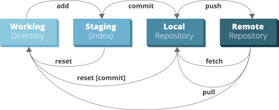
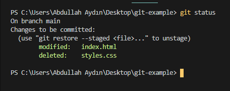
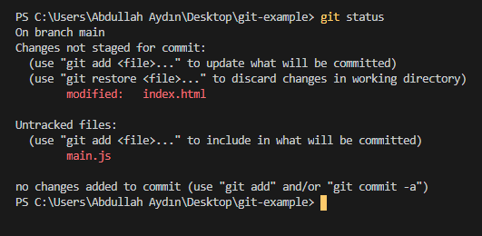
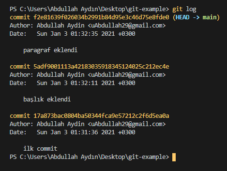

# VS Code içinde Terminal Kullanarak GIT Temel Komutları

GIT temel komutlarını VS Code içerisindeki terminalde kullanmak için menü barından Terminal'i (1) açarak New Terminal (2) seçeneğini seçmelisiniz.


## GIT Temel Komutları





Başlıca bilmemiz gereken bazı terimler;

> **untracked (izlenmeyen):** GIT tarafından henüz takip edilmeyen, yani yeni oluşturulmuş dosyaları ifade eder.
>
> **unstaged (hazırlanmamış):** Güncellenmiş ancak *commit*’lenmek için hazırlanmamış dosyaları ifade eder.
>
> **staged (hazırlanmış):** *Commit*’lenmeye hazır olan dosyaları ifade eder.
>
> **deleted (silinmiş):** Projeden silinmiş ama GIT üzerinden kaldırılmamış dosyaları ifade eder.


#### git init

Henüz versiyon kontrolü altında olmayan bir projenin dizininde, boş bir git deposu oluşturmak için kullanılır. 

```
$ git init
```


#### git config

Git’in bir çok konfigürasyon ve ayarı vardır, bunlardan ikisi user.name ve user.email olanıdır. Bu ayarları yapılandırmak için aşağıdaki komutları kullanırız.

```
$ git config --global user.name "Name Surname"
```

```
$ git config --global user.email "test@email.com"
```

Bu ayarların bütününü görüntülemek için;

```
$ git config --list
```


Not:  Eğer windows işletim sistemi kullanıyorsanız, böyle bir hata ile karşılaşabilirsiniz. 

> ```
> warning: LF will be replaced by CRLF in kaynak/dosya/yolu
> ```

Bu hatanın çözümü için aşağıdaki komutu kullanabilirsiniz.

```
$ git config core.autocrlf true
```


#### git add

Yeni eklenen veya üzerinde değişiklik yapılan dosyaları **staged** ortamına göndermek için kullanılır.

```
$ git add <dosya veya klasor_name>
```

Tek seferde bütün dosyaları eklemek için ise,

```
$ git add .  veya  $ git add *  veya   $ git add -A .
```

Buradaki **-A** (all) tümü anlamındadır. “ . ” ise tüm dosya uzantılarını ifade eder. 


#### git rm

Staged ortamına eklenmiş bir dosyanın takibinin bırakılması yani **untracked** (izlenmeyen) hale getirilmesi sağlayan komuttur.

```
$ git rm  --cached <dosya veya klasor_name>
```

Dosyayı klasörden silmek istiyorsak eğer, aşağı komutu kullanılırız.

```
$ git rm <dosya veya klasor_name>
```


#### git status

Üzerinde çalışılan projenin o anki durumu hakkında bilgi verir. Yapılan değişiklikler, eklenen ve silinen dosyalar gibi bilgiler listelenir.

```
$ git status
```



On branch main -> *Main* branch'inde olduğumuzu,

Changes to be commited -> Commit'lenmeye hazır değişiklikler olduğunu,

Modified: index.html -> Index.html dosyasında **değişiklik** yaptığımızı,

Deleted: styles.css -> styles.css dosyasını ***sildiğimizi***,



Changes not staged for commit -> Üzerinde değişiklik yapılan ama staged ortamına gönderilmemiş dosyaları ifade eder.

Untracked files -> takibi yapılmayan dosyaları ifade eder.


#### git commit

*Commit*, **staged** ortamına alınan dosyaların *Local Repository*’e gönderilmesidir.  En iyi uygulama yöntemi her kayıt sırasında yapılan değişiklikleri açıklayıcı bir mesaj eklemektir. Ayrıca her commit benzersiz bir kimliğe (unique ID) sahip olur.

```
$ git commit -m "ilk commit mesajı"
```

Buradaki **-m** (message) mesaj anlamındadır.


#### git log

Projedeki commit geçmişini görüntülememizi sağlar. Bütün commit'ler, id'si, yazarı, tarihi ve mesajı ile beraber listelenir.

```
$ git log
```




#### git branch

Local veya remote repository üzerinde yeni bir branch (dal) eklemek, silmek veya listelemek için kullanılır.

*yeni bir branch eklemek için*;

```
$ git branch <branch_name>
```

*tüm uzak ve yerel branch'leri listelemek için;*

```
$ git branch -a
```

*bir branch'i silmek için;*

```
$ git branch -d <branch_name>
```


#### git checkout

Branch’ler veya commitler arası geçiş yapmak için kullanılır.

*mevcutta var olan branch'e geçiş yapmak için;*

```
$ git checkout <branch_name>
```

*yeni bir branch oluşturup, bu branch'e geçiş yapmak için;*

```
$ git checkout -b <branch_name>
```

*commitler arası geçiş yapmak için;*

```
$ git checkout <commit_ID>
```


#### git merge

Başka bir branch'de olan değişiklikleri, bulunduğumuz branch ile birleştirmek istediğimizde kullanılır.

```
$ git merge <branch_name>
```


#### git clone

Mevcut bir uzak repoda bulunan dosyaların bilgisayarımızda bir kopyasının oluşturulmasını sağlar.

```
$ git clone <remote_URL>
```


#### git push

Projemizde aldığımız commit'leri, remote repository'e gönderir.

```
$ git push origin master
```

*Burada bahsi geçen `origin` remote repository’nin kök dizinini belirtir ve sabit bir isimdir. `master` ise sizin çalıştığınız branch (dal)’ı belirtir.*


*Henüz remote repository’niz yoksa aşağıdaki komut ile local deponuzu uzak sunucudaki depoya bağlayabilirsiniz.*

```
$ git remote add origin http://uzak_deponun_adresi.git
```


#### git diff

Repository üzerinde yapılan değişikliklerden sonra dosyalar arasında oluşan farklılıkları göterir.

*çalışma dizini ile repository (HEAD) arasındaki farklılıkları görmek için;*

```
$ git diff HEAD
```

*iki commit arasındaki farklılıkları görmek için;*

```
$ git diff <commit_id_1>..<commit_id_2>
```

*çalışma dizini ve staged ortamı arasındaki farkları görmek için;*

```
$ git diff --staged
```

### KAYNAKÇA

- https://medium.com/fedeveloper/git-bash-ile-komut-komut-versiyonlama-a354efd3063f
- https://www.jrebel.com/blog/git-cheat-sheet
- http://guides.beanstalkapp.com/version-control/common-git-commands.html
