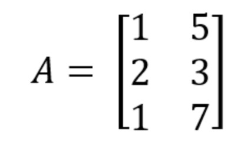

# Java'da Dizi ve Matris'ler

## Java&#39;da Dizi (Array)

Dizi (Array) kavramı programlama dillerinde bir veri tipini ifade eder. Bu veri tipi liste halindeki ardışık verileri bir arada tutan yapıya denilir. Bu ardışık yapıya ait elemanlara indeks yoluyla erişim sağlanabilir. Diziler sabit boyutludur. Örneğin: 10 elemanlık dizi. Dizilerde aynı tipten veri tutulur. Örneğin: tüm elemanları &quot;int&quot; olan bir dizi.

Dizi&#39;nin hafızada bir başlangıç adresi olur ve ardışık olan diğer elemanlar sırayla hafızaya yerleştirilir. Dizi&#39;ler &quot;new&quot; anahtar sözcüğüyle oluşturulur. Böylece, Heap Hafıza bölgesinde yer kaplarlar.

````java
double[] myList;   // tercih edilen yol

veya 

double myList[];   // başka türlü tanımlama biçimi
````

Diziler veri tipi ve [] parantezler ile belirtilir. Yukarıda iki farklı tanımı görülmektedir. Hafızadan yer alıp diziye alan ayırabilmek için &quot;new&quot; anahtar kelimesi kullanılır.

 ````java
double[] myList = new double[10];
 ````

Yukarıda maksimum 10 eleman alabilen &quot;double&quot; veri tipinde olan bir dizi oluşturulmuştur.


Yukarıda &quot;myList&quot; isminde bir dizi tanımlamıştık. Tanımlanan dizi hafıza yukarıdaki şekildeki gibi tutulur. &quot;myList&quot; değişkeni dizinin başlangıç adresini tutar. Dizilerde ardışık bir sıra olduğu için ilk elemandan sonra gelen elemanların hafıza adresleri de birer birer artar. Dizi blok halinde yer kaplar. Diziye erişmek için indeks numarası kullanılır. Örneğin: &quot;myList[0]&quot; demek dizinin 1. Elemanını verecektir. Java&#39;da dizilerin indeksleri sıfırdan başlar. Örneğin: &quot;myList[5]&quot;, yani 5 nolu indeksteki dizi elemanını ver dediğimizde aslında dizinin 6. Elemanına erişmiş oluruz.

Örnekler:

````java
// Java'da diziye ilk değerler süslü parantezler arasında verilir.
double[] myList = { 1.9, 2.9, 3.4, 3.5 };

// tüm dizi elemanlarını arada boşuk bırakarak sırayla ekrana yazdırır.
for (int i = 0; i < myList.length; i++)
{
	System.out.println(myList[i] + " ");
}
````

Yukarıdaki örnekte myList isimli diziye ilk değerleri hemen verilmiştir. Süslü parantezler arasında kalan değerler dizi elemanlarıdır.

Ardından, bir &quot;for&quot; döngüsü ile dizi elemanları ekrana yazdırılır.

### Dizileri fonksiyonlara parametre olarak göndermek

Tanımladığınız dizileri fonksiyonlara parametre olarak gönderebilirsiniz.

Örneğin elimizde static bir fonksiyon olsun. Bu fonksiyona int tipinde verileri olan bir diziyi girdi (input) olarak vermek istersek aşağıdaki gibi olur.

````java
public static void printArray(int[] array) 
{
   for (int i = 0; i < array.length; i++) 
   {
      System.out.print(array[i] + " ");
   }
}
````

printArray ( int[] array ) kırmızı olarak işaretlediğimiz yer diziyi yerel değişken olarak fonksiyona gönderdiğimiz noktadır. Java&#39;da tüm değişkenler &quot;Pass by Value&quot; yöntemiyle geçilir. Bu şu demektir. Sizin tanımladığınız değişkenin, nesnenin veya dizinin birebir kopyası oluşturulur. Bu kopya değer fonksiyona yerel değişken olarak gider. Bu Java mülakatlarında size sorulabilecek bir detaydır.

### Dizileri fonksiyonlardan geri döndürmek

Fonksiyonlar belli bir işi yapıp sonucunda değer dönebilen veya dönmeyen kod bloklarıdır. Fonksiyonlar için altın kural, her fonksiyonun tek bir işi olmalıdır. Örneğin: dizi ortalaması alma işi yapan bir fonksiyon dizileri ekrana yazdırma işini yapmamalıdır. Veya dizilerin ortalamasını alma işi ile dizileri toplama işlemi aynı fonksiyon içinde olmamalıdır. Her biri ayrı fonksiyonlar olmalıdır.

````java
public static int[] reverse(int[] list) 
{
   int[] result = new int[list.length];

   for (int i = 0, j = result.length - 1; i < list.length; i++, j--) 
   {
      result[j] = list[i];
   }
   
   return result;
}

````


Yukarıda dizinin tersine çevrilmiş halini döndüren bir fonksiyon vardır. public static **int[]** reverse(…)  koyu renkle işaretlenen alan dizi döndüreceğimizi ve bu dizinin veri tipini söylüyoruz. Burada veri tipimiz &quot;int".

## Java&#39;da Matris İşlemleri (Matrice)

Java&#39;da matrisler varsayılan bir veri tipi olarak bulunmazlar. Dizilerin 2 boyutlu halleri şeklinde tanımlanırlar. Matris satır ve sütun şeklinde tablo verisi formatındaki verileri tutmak için kullanılır. Diziler liste halinde veriler için uygunken, matrisler tablo şeklindeki veriler için uygundur.

Örnek:

3x2 &#39;lik bir matris olduğunu düşünelim.



2x4 &#39;lük başka bir ise aşağıdaki gibi olacaktır.


Bu iki matrisin çarpımıyla ise C isminde 3x4 &#39;lük bir matris oluşacaktır. Buradaki çarpma yöntemi A&#39;nın satırını komple al, B&#39;nin sütunu komple al ve birbiriyle çarp sonucu C matrise yaz. Kabaca yöntem bu şekilde, bu yöntemin matematiksel izahı ise aşağıdaki gibidir.


C matrisi sonuç matrisidir.

Formül:


Yukarıdaki A ve B matrisinin Java&#39;da tanımlanması aşağıdaki gibidir.

````java
double[][] A = {
  new double[]{1d, 5d},
  new double[]{2d, 3d},
  new double[]{1d, 7d}
};
 
double[][] B = {
  new double[]{1d, 2d, 3d, 7d},
  new double[]{5d, 2d, 8d, 1d}
};

````


Dizilerden tek farkı [] parantez yanına bir tane [] açıyoruz. Zaten her [] ifadesi yeni bir boyut anlamına geliyor. &quot;**double[][][] ucBoyutlu;**&quot; şeklinde bir ifadeyle 3 boyutlu veri saklayan bir veri yapısı oluşturmuş oluyoruz.

````java
public double[][] multiplyMatrices(double[][] firstMatrix, double[][] secondMatrix) {

	// firstMatrix.length ile ilk matrisin satır sayısını buluyoruz. örneğimizde 3 olarak gelecektir.
	// secondMatrix[0].length ile ikinci matrisin sütun sayısını buluyoruz. örneğimizde 4 olarak gelecektir.

	// C matrisi olacak olan matrisi tanımlıyoruz.
    double[][] result = new double[firstMatrix.length][secondMatrix[0].length];
 
 	// matrislerde çarpma, toplama gibi işlemleri yapabilmek için iç içe 3 tane döngüye ihtiyaç duyarız.
    for (int row = 0; row < result.length; row++) {
        for (int col = 0; col < result[row].length; col++) {
            result[row][col] = multiplyMatricesCell(firstMatrix, secondMatrix, row, col);
        }
    }
 
    return result;
}


double multiplyMatricesCell(double[][] firstMatrix, double[][] secondMatrix, int row, int col) {
	// A matrisinin satırı ile B matrisinin sütunu çarpma işlemi.
	/*
	*   row = 3, col = 4  olarak gelecektir.
	*   i = 0 ise
	*   firstMatrix[3][0] * secondMatrix[0][4] 
	*   i = 1 ise
	*   firstMatrix[3][1] * secondMatrix[1][4] 
	*   i = 2 ise
	*   firstMatrix[3][2] * secondMatrix[2][4] 
	* şeklinde i değişerek satır ve sütun çarpılır.
	*/
    double cell = 0;
    for (int i = 0; i < secondMatrix.length; i++) {
        cell += firstMatrix[row][i] * secondMatrix[i][col];
    }
    return cell;
}

````

Yukarıdaki “multiplyMatrices” fonksiyonu iki tane matrisi girdi olarak alır. Fonksiyon matrislerin çarpım sonucunu matris olarak döndürür.

“multiplyMatrices” fonksiyonu içinde bir başka fonksiyon daha çağrılmıştır. “multiplyMatricesCell” bu fonksiyon ise iki matrisin satır ve sütununu çarpıp sonucu double tipte bir değer döndürür.


Yukarıdaki &quot;multiplyMatrices&quot; fonksiyonu iki tane matrisi girdi olarak alır. Fonksiyon matrislerin çarpım sonucunu matris olarak döndürür.

&quot;multiplyMatrices&quot; fonksiyonu içinde bir başka fonksiyon daha çağrılmıştır. &quot;multiplyMatricesCell&quot; bu fonksiyon ise iki matrisin satır ve sütununu çarpıp sonucu double tipte bir değer döndürür.