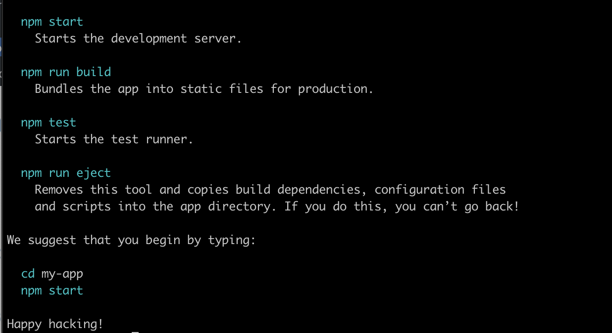
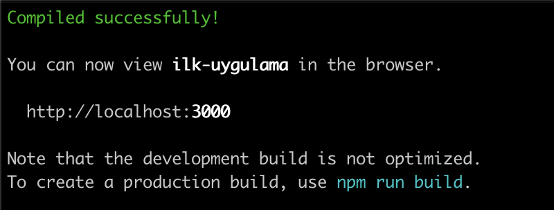
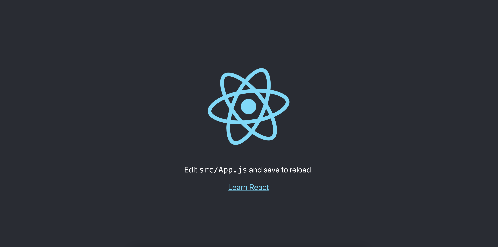
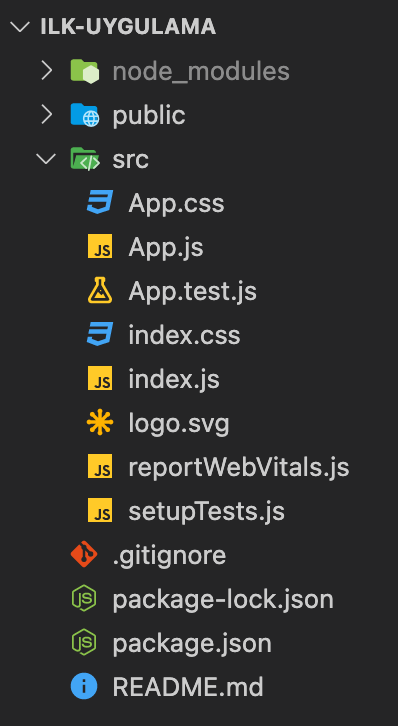

# React Uygulaması Oluşturma

Dökümantasyonunda da belirtildiği üzere React, baştan sona aşamalı olarak kullanılabilecek şekilde tasarlanmıştır. Bu demek oluyor ki ihtiyaca göre az ya da daha fazla kullanmak mümkün. Var olan bir HTML sayfasına React'i entegre edebileceğimiz gibi bazı araçları da içeren geliştirme ortamının hazırlanmasıyla birlikte yeni bir tek sayfa uygulama (Single Page Application) oluşturabiliriz. Bu yazıda `create-react-app` ile yeni bir React uygulaması oluşturmayı öğreneceğiz.

## Giriş

Bir React uygulaması oluşturmak için bazı bağımlılık ve gereksinimlere ihtiyaç duyuyoruz. Bunların içerisinde hem modüler bileşenler oluşturmak için kullanılan zorunlu paketler (react, react-dom) hem de konfigürasyon dosyaları (webpack, babel) yer alıyor. Bunların hepsini ve daha fazlasını bizim için yapan bir araç olan *create-react-app* ile kolay ve hızlı bir şekilde bir React.js uygulaması oluşturmak mümkün. Bu araç React ekibi tarafından sunuluyor ve hem React öğrenmeye yeni başlayanlar hem de belirli ölçekte proje geliştirmek isteyenler için bir hazır bir iskelet yapı sağlıyor. Bu sayede Babel, webpack gibi bağımlılıkları manuel olarak konfigüre etmeye gerek kalmadan hızlıca bir React.js uygulaması geliştirmeye başlayabiliyoruz.

## Hazırlık

[*create-react-app*](https://create-react-app.dev/docs/getting-started/) ile proje ortamını oluşturabilmek için bilgisayarımıza Node.js kurmamız gerekiyor. Node'un yüklü olup olmadığını kontrol etmek için terminalde `node -v` komutunu çalıştırabilirsiniz. Eğer Node yüklüyse bu kodu çalıştırdığınızda bir versiyon numara çıktısı görmeniz gerekir. Eğer yüklü değilse [bu bağlantıdan](https://nodejs.org/en/download/) indirip kurabilirsiniz. 

Ayrıca geliştirme yapabilmek için bir kod editöre ihtiyacımız var. En çok kullanılan kod editörlerden biri olan [Visual Studio Code](https://code.visualstudio.com/)'u ücretsiz olarak indirebilirsiniz.

Node.js'i bilgisayarımıza kurduktan sonra *npm* de otomatik olarak yüklenmiş oluyor. npm (*node package manager*) bir paket yöneticisi olup Node.js'ten ayrı bir projedir. Bu yüzden bilgisayarınızda Node.js kurulu olsa bile bir react projesi oluşturmadan önce terminalde `npm install -g npm@latest` komutunu çalıştırarak en güncel versiyonda olduğundan emin olabilirsiniz. (macOS ve Linux kullanıcıları bu komutu çalıştırırken hata almaları durumunda komutun başına sudo ekleyerek çalıştırabilirler)

Node.js kurulumunu yapıp, npm'in güncel versiyonda olduğunu kontrol ettikten sonra artık React.js uygulaması için hazır bir iskelet yapı oluşturmaya geçebiliriz. Komutu çalıştırmadan önce doğru klasör dizininde olduğumuzdan emin olmalıyız. Terminal aracılığı ile React uygulamasını oluşturmak istediğimiz dosya dizinine gitmemiz için bize gerekli olan başlıca terminal komutlarından bahsetmek gerekirse;

-  ***pwd*** komutu ile bulunduğumuz dizini görüntüleyebiliriz. *(MacOS ve Linux için geçerli)*
- ***cd*** komutu ile uygulamanın oluşturulmasını istediğimiz klasöre gidebiliriz. 
- ***mkdir*** komutu ile yeni bir klasör oluşturabiliriz. 

Ayrıca terminali/komut istemini ilk başlattığınızda;

* **Windows kullanıcıları:** `C:\Users\KullaniciAdi`

* **MacOS kullanıcıları:**  `/Users/KullaniciAdi`

* **Linux kullanıcıları:**  `/home/KullaniciAdi`

 klasör dizininde olduğumuzu unutmamalıyız.

> Bu gibi kavramlara uzaksanız. Kendi işletim sisteminizde terminal komutlarıyla ilgili aramalar yapmanızı tavsiye ederiz.

## Projeyi Oluşturma: *create-react-app*

Bir React projesi oluşturmanın en kolay yöntemlerinden biri olan create-react-app ile projemizi oluşturabiliriz.

`npx create-react-app ilk-uygulama` komutunu kullanarak bulunduğumuz klasör dizininde bir React.js uygulaması oluşturabiliriz. *(Unutmayın eğer terminal içerisinde yerinizi değiştirmediyseniz yukarıda yazdığımız klasörün altında oluşacak.)*

**Not:** Burada kullandığımız *npx* npm 5.2+ ile gelen bir paket çalıştırma aracıdır.

Burada *ilk-uygulama*, uygulamaya vermek istediğimiz isimdir. Bunun yerine istediğiniz uygulama ismini verebilirsiniz (büyük harf içermediği sürece).  

Komutu çalıştırdıktan sonra bazı ufak ipuçlarının da olduğu böyle bir çıktı ile karşılaşacaksınız. Bu demek oluyor ki React.js uygulaması sağlıklı bir şekilde oluşturuldu ve geliştirme ortamı hazırlandı. Burada start, run build, test ve run eject olmak üzere 4 adet script ismi görüyoruz. Biz create-react-app'in bize sağlamış olduğu start scriptini kullanarak projemizi localhost üzerinde çalıştıracağız. 

`cd ilk-uygulama`

`npm run start`

komutlarını çalıştırdıktan sonra geliştirme web sunucusu başlatılmış olacak ve projemiz 3000 numaralı port üzerinde çalışıyor olacak. 

Otomatik olarak açılan tarayıcı ile http://localhost:3000/ adresinden projenin çalışıyor olduğunu aşağıdaki çıktı eşliğinde görebileceğiz.

Buradan da anlaşılabileceği üzere App adında bir bileşeni görüntülüyoruz. Bileşenleri (component) React'in yapı taşları olarak düşünebiliriz. Dolayısıyla bir bileşen aslında bir JavaScript sınıfı (class) ya da fonksiyonudur. Bir React uygulaması  tasarımına bağlı olarak birkaç ya da binlerce bileşenin bir araya gelmesiyle oluşabilir. Tasarım ilkelerine göre bu sayının çok fazla büyüyebileceğini söyleyebiliriz. 

**Not:** React ekibi Facebook'da 50 binden fazla bileşen kullanıldığını söylüyor.

*Create React App* içerisinde sunulan bazı özellikler:

- Hot reloading: kod üzerindeki değişikleri kaydettikten sonra uygulamayı baştan başlatmadan değişikliklerin arayüze yansıması
-  ESLint: kodun belirli standartlara göre yazılmasını sağlayan modül 
-  Canlı ortam (production) için kodun optimize edilmesi (build scripti aracılığıyla)

## Klasör Yapısı

*create-react-app* ile bir React uygulaması oluşturduğumuzda yukarıdaki gibi bir klasör yapısına sahip oluyoruz. Burada **src** klasörü altında olan **App.js** ekranda gösterilen bileşen, **index.js** React uygulamasının başlangıç noktasıdır. index.js bütün React uygulamasının nerede render edileceğini belirler. Bu dosyaya gidip incelediğimizde `'root'` id ile belirtilmiş bir HTML etiketine bütün uygulamanın render edileceğini görebiliriz. public klasörü altında index.html'e gittiğimizde ise bu bahsettiğimiz `'root'` id'li `
` etiketini görebiliriz.

**public/:** Bu klasör React uygulamamızın static asset'lerini içeriyor. (index.html gibi)

**src/:** Bu klasör React uygulamamızın JavaScript dosyalarını içeriyor. Burada bütün uygulamanın başlangıç noktası olan index.js ve App adlı bileşeni (component) içeriyor. 

**node_modules/:** Bu klasör içerisinde projenin bütün bağımlılıkları (Node.js Paket Yöneticisi - npm kullanılarak indirilen paketler) yer alıyor.  

**package.json:** Bu dosya bir tür manifest dosyasıdır. Projenin ismini, versiyonunu, manuel scriptleri ve projeye dahil edilen bütün paketlerin listesini (versiyonlarıyla birlikte) içerir. package-lock.json dosyası ise her paketin birebir sürümlendirilmiş bağımlılık ağacını tutar. Böylece diğer geliştiriciler ve proje sürümleri için garanti edilmiş versiyonlar saklanır. 

**.gitignore:** Bu dosya sayesinde istenmeyen uzantıdaki ve dizindeki dosyaların takip edilmesini engellemiş oluruz. Böylece git sunucularına göndermek istemediğimiz dosyalar takip edilmez. create-react-app ile node_modules klasörü altındaki paketler ve build klasörü .gitignore içerisinde belirtilmiş olarak gelir.

Uygulamayı geliştirme aşamasında start script'ini kullanarak sunucuyu başlatmaktan ve uygulamanın ayağa kaldırılmasından bahsetmiştik. **create-react-app**'in sunmuş olduğu bir diğer önemli script ise **build**. React modüler bir yapı sunuyor ve birçok bileşenden oluşan uygulamalar ortaya çıkıyor. Build scripti oluşturulan bütün ayrı bileşenleri birleştirilip küçültülüyor ve optimize hale getiriyor. Bu sayede canlı ortama (production) alınabilecek bir uygulamaya sahip oluyoruz.

## Kaynaklar

https://tr.reactjs.org/docs/create-a-new-react-app.html

https://github.com/facebook/create-react-app

https://create-react-app.dev/docs/getting-started/

https://www.codecademy.com/articles/how-to-create-a-react-app

https://blog.logrocket.com/everything-you-need-to-know-about-react-scripts/

https://medium.com/frontend-development-with-js/react-geli%C5%9Ftirme-ortam%C4%B1n%C4%B1n-olu%C5%9Fturulmas%C4%B1-c2eba4e5d30f

https://blog.finartz.com/reactjs-nedir-s%C4%B1f%C4%B1rdan-react-e600d7b29f8

https://scotch.io/starters/react/using-create-react-app-to-make-react-applications

https://omergulcicek.github.io/react/kurulum/reactjs-kurulumu.html

https://medium.com/codingthesmartway-com-blog/modern-react-from-the-beginning-ep1-creating-your-first-react-app-522fced53eed
